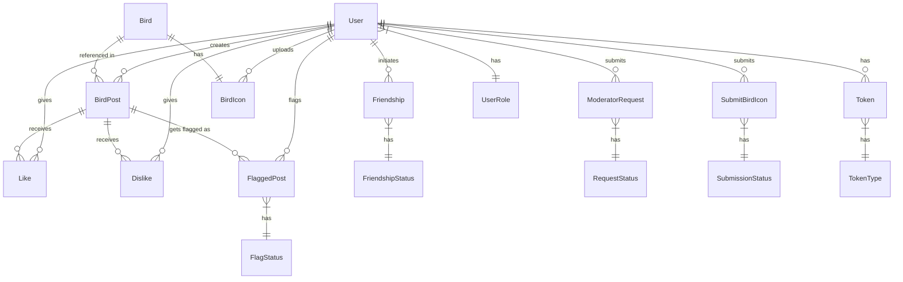

# Database Models Documentation

## Entity Relationship Diagram



## Database Tables

### User
```sql
Table User {
  id                Int           @id @default(autoincrement())
  username          String        @unique
  email             String        @unique
  password          String
  role              UserRole      @default(USER)
  profilePicture    String?
  createdAt         DateTime      @default(now())
  lastActive        DateTime      @default(now())
  deactivated       DateTime?

  // Relations
  posts             BirdPost[]
  likes             Like[]
  dislikes          Dislike[]
  friends           Friendship[]  @relation("UserFriends")
  friendsOf         Friendship[]  @relation("FriendsOfUser")
  moderatorRequests ModeratorRequest[]
  flaggedPosts      FlaggedPost[]
  tokens            Token[]
  birdIcons         BirdIcon[]
  submittedIcons    SubmitBirdIcon[]
}
```

### Bird
```sql
Table Bird {
  id          Int          @id @default(autoincrement())
  name        String
  species     String
  description String
  iconId      Int?         @unique
  
  // Relations
  icon        BirdIcon?    @relation(fields: [iconId], references: [id])
  birdPosts   BirdPost[]
}
```

### BirdPost
```sql
Table BirdPost {
  id          Int       @id @default(autoincrement())
  userId      Int
  birdId      Int
  description String
  latitude    Float
  longitude   Float
  photos      String[]
  createdAt   DateTime  @default(now())
  
  // Relations
  user        User      @relation(fields: [userId], references: [id])
  bird        Bird      @relation(fields: [birdId], references: [id])
  likes       Like[]
  dislikes    Dislike[]
  flags       FlaggedPost[]
}
```

### BirdIcon
```sql
Table BirdIcon {
  id            Int      @id @default(autoincrement())
  url           String
  birdId        Int?
  uploadedById  Int
  verified      Boolean  @default(false)
  
  // Relations
  bird          Bird?    
  uploadedBy    User     @relation(fields: [uploadedById], references: [id])
}
```

### SubmitBirdIcon
```sql
Table SubmitBirdIcon {
  id          Int              @id @default(autoincrement())
  url         String
  userId      Int
  status      SubmissionStatus @default(PENDING)
  createdAt   DateTime         @default(now())
  
  // Relations
  user        User             @relation(fields: [userId], references: [id])
}
```

### Friendship
```sql
Table Friendship {
  id        Int              @id @default(autoincrement())
  userId    Int
  friendId  Int
  status    FriendshipStatus
  createdAt DateTime         @default(now())
  
  // Relations
  user      User             @relation("UserFriends", fields: [userId], references: [id])
  friend    User             @relation("FriendsOfUser", fields: [friendId], references: [id])
  
  @@unique([userId, friendId])
}
```

### ModeratorRequest
```sql
Table ModeratorRequest {
  id             Int           @id @default(autoincrement())
  userId         Int
  description    String
  qualifications String
  location       String
  status         RequestStatus @default(PENDING)
  createdAt      DateTime      @default(now())
  
  // Relations
  user           User          @relation(fields: [userId], references: [id])
}
```

### FlaggedPost
```sql
Table FlaggedPost {
  id        Int        @id @default(autoincrement())
  postId    Int
  userId    Int
  reason    String
  status    FlagStatus @default(PENDING)
  createdAt DateTime   @default(now())
  
  // Relations
  post      BirdPost   @relation(fields: [postId], references: [id])
  user      User       @relation(fields: [userId], references: [id])
}
```

### Like
```sql
Table Like {
  id        Int      @id @default(autoincrement())
  userId    Int
  postId    Int
  createdAt DateTime @default(now())
  
  // Relations
  user      User     @relation(fields: [userId], references: [id])
  post      BirdPost @relation(fields: [postId], references: [id])
  
  @@unique([userId, postId])
}
```

### Dislike
```sql
Table Dislike {
  id        Int      @id @default(autoincrement())
  userId    Int
  postId    Int
  createdAt DateTime @default(now())
  
  // Relations
  user      User     @relation(fields: [userId], references: [id])
  post      BirdPost @relation(fields: [postId], references: [id])
  
  @@unique([userId, postId])
}
```

### Token
```sql
Table Token {
  id        Int       @id @default(autoincrement())
  userId    Int
  token     String    @unique
  type      TokenType
  expiresAt DateTime
  createdAt DateTime  @default(now())
  isActive  Boolean   @default(true)
  
  // Relations
  user      User      @relation(fields: [userId], references: [id])
}
```

## Enums

### UserRole
```typescript
enum UserRole {
  USER
  MODERATOR
  ADMIN
}
```

### FriendshipStatus
```typescript
enum FriendshipStatus {
  PENDING
  ACCEPTED
  DECLINED
}
```

### RequestStatus
```typescript
enum RequestStatus {
  PENDING
  APPROVED
  REJECTED
}
```

### FlagStatus
```typescript
enum FlagStatus {
  PENDING
  RESOLVED
  DISMISSED
}
```

### SubmissionStatus
```typescript
enum SubmissionStatus {
  PENDING
  APPROVED
  REJECTED
}
```

### TokenType
```typescript
enum TokenType {
  PASSWORD_RESET
  ACCOUNT_VERIFICATION
  ONE_TIME_LOGIN
  DEACTIVATION
}
```